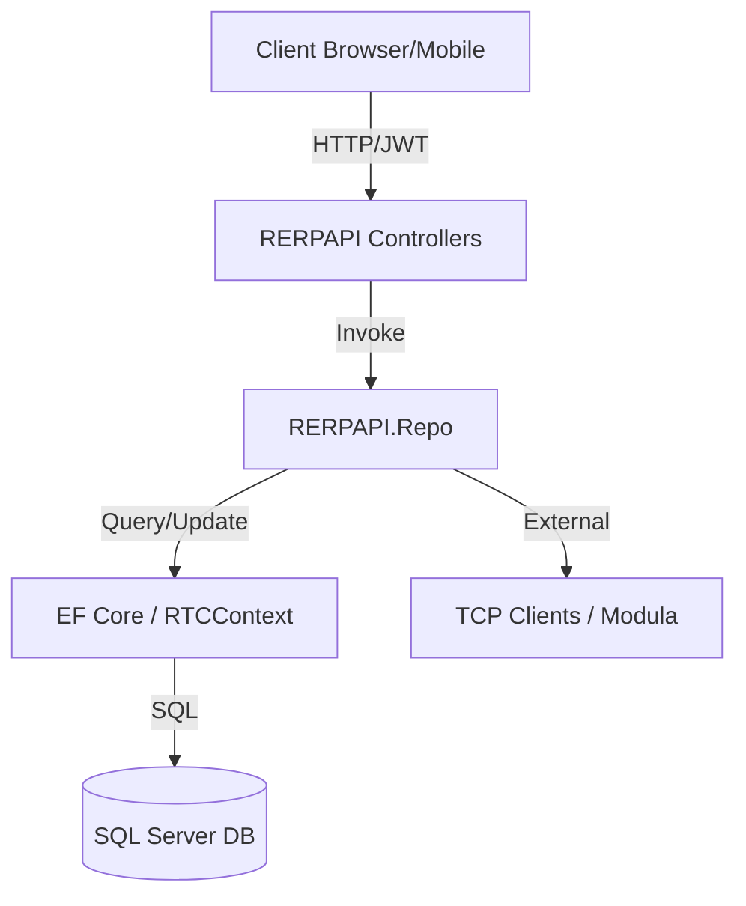

# System Architecture: R_ERP Backend

This document describes the architectural patterns and communication flows of the R_ERP Backend system.

## Layered Architecture

The solution is divided into four primary projects reflecting a clean separation of concerns:

1. **API Layer (`RERPAPI`)**
   - **Entry Point**: `Program.cs` and `Controllers`.
   - **Responsibilities**: Routing, Authorization (Middleware), Request Validation, and SSE/Socket management.
   - **Dependencies**: Depends on `IRepo` for abstractions and `Repo` for implementation.

2. **Interface Layer (`RERPAPI.IRepo`)**
   - **Responsibilities**: Defines the contracts (Interfaces) for data access. Ensures decoupling between controllers and implementation.

3. **Implementation Layer (`RERPAPI.Repo`)**
   - **Responsibilities**: Implements the business logic and data access using Entity Framework Core. Contains the `GenericRepo` foundation.

4. **Model/Data Layer (`RERPAPI.Model`)**
   - **Responsibilities**: Centralized storage for POCO Entities, DTOs (Data Transfer Objects), and the `RTCContext` (Database Context).

## Data Flow Diagram

## Key Architectural Patterns

- **Repository Pattern**: Extensively used to isolate persistence logic. New features create a specific `Repo` inheriting from a `GenericRepo`.
- **Dependency Injection**: Managed in `Program.cs`. Most services and repos are registered as `Scoped`.
- **Dynamic Authorization**: Custom middleware (`DynamicAuthorizationMiddleware`) intercepts requests to verify user permissions against requested menu-level rights.
- **Micro-Services Hybrid**: While the system is a monolith, modules (HRM, Project, Warehousing) are namespaced internally to allow for future decoupling.

## Integration Points
- **Database**: SQL Server using standard Connection Strings.
- **Real-time**: `SseService` for Server-Sent Events.
- **Hardware Integration**: `PersistentTcpClientService` for communicating with warehouse automation (Modula).
